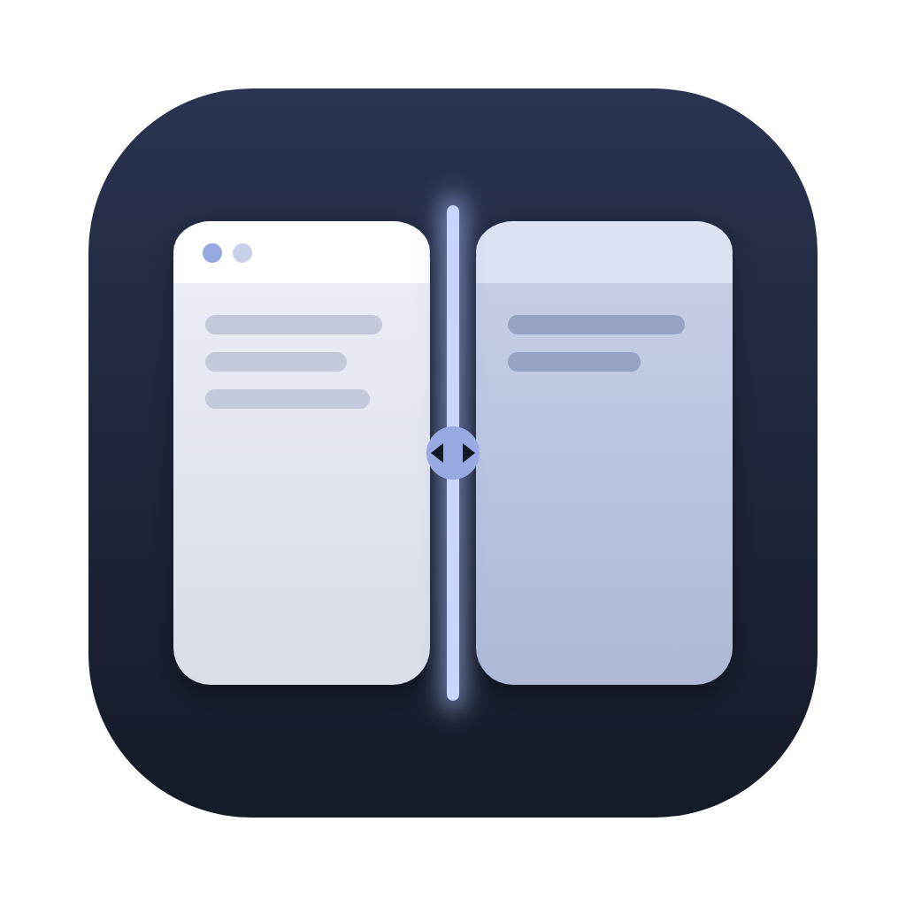

# Seam

**Fenster anordnen in der Menüleiste. Zwei Fenster, eine Naht, und beide gehen mit.**

Kostenlos · Open Source (MIT) · für macOS 27 auf Macs mit Apple Silicon · kein Konto, keine Analyse

**Website:** [miwixyz.github.io/Seam](https://miwixyz.github.io/Seam/)

---

## Seam in 30 Sekunden

Seam legt Fenster per Tastenkürzel auf Hälften, Viertel und Drittel, oder du ziehst sie an den Bildschirmrand und eine Fläche zeigt dir vorher, wo sie landen.

Die Besonderheit ist die Naht. Mit ⌃⌥S teilst du den Bildschirm zwischen dem aktiven und dem zuletzt benutzten Fenster. Mit ⌃⌥⇧← und ⌃⌥⇧→ verschiebst du die Kante zwischen beiden in festen Stufen, und beide Fenster gehen im selben Schritt mit. Wird das eine breiter, wird das andere schmaler, ohne dass du es von Hand nachziehen musst.

---

## Die Naht

Mit ⌃⌥S teilen sich das aktive Fenster und das Fenster, das du davor benutzt hast, den Bildschirm. Jedes bleibt auf seiner Seite, beide in voller Höhe. ⌃⌥⇧← und ⌃⌥⇧→ verschieben die Naht zwischen den Stufen ⅓, ⅜, ½, ⅝ und ⅔. Auf einem hochkant gestellten Bildschirm wandert sie nach oben und unten.

Auch die normalen Kürzel nehmen den Nachbarn mit: Legst du ein Fenster auf eine Hälfte, ein Drittel oder ein Viertel, rückt das Fenster gegenüber an die Naht. Ziehst du die gemeinsame Kante mit der Maus, bewegt sich zunächst nur dein Fenster. Beim Loslassen setzt Seam das Nachbarfenster bündig an die neue Kante.

Es ziehen nur sichtbare Nachbarn mit. Stößt ein Fenster an seine Mindestgröße, bleibt die Kante dort stehen.

---

## Was Seam kann

| Was du willst | So macht es Seam |
|---|---|
| Zwei Fenster nebeneinander | ⌃⌥S teilt den Bildschirm zwischen dem aktiven und dem zuletzt benutzten Fenster |
| Ein Fenster breiter, das andere schmaler | ⌃⌥⇧← und ⌃⌥⇧→ verschieben die Naht in festen Stufen, beide Fenster gehen mit |
| Ein Fenster auf eine Hälfte oder in eine Ecke | Je ein Kürzel für jede Hälfte und jedes Viertel |
| Drittel und zwei Drittel | Je ein Kürzel für links, Mitte und rechts, als Drittel oder als zwei Drittel |
| Bildschirm füllen oder Fenster mittig setzen | Maximieren mit ⌃⌘↩, zentrieren mit ⌃⌘↖ |
| Zurück zur alten Größe | ⌃⌥⌫, oder ein angedocktes Fenster einfach herausziehen |
| Ohne Tastatur anordnen | Fenster an den Bildschirmrand ziehen, eine Vorschaufläche zeigt das Ziel |
| Mit mehreren Bildschirmen arbeiten | ⌃⌥⌘← und ⌃⌥⌘→ schicken das Fenster auf den vorherigen oder nächsten Bildschirm |
| Einen Bildschirm hochkant nutzen | Ein eigener Satz Kürzel, Drittel teilen dann von oben nach unten |
| Etwas Luft zwischen den Fenstern | Abstand wählbar: 0, 5, 10 oder 20 Punkt |
| Kürzel nachschlagen | Die Kürzel fürs Querformat stehen mit Piktogramm direkt im Menü, ein Klick wendet sie an. Die Beschriftung folgt deiner Tastaturbelegung. Die Kürzel für Hochkant liegen unter „Einstellungen“ |

---

## Für wen

Für alle, die am Mac meistens mit zwei Fenstern nebeneinander arbeiten: Mail neben Kalender oder Text neben Recherche. Wer das Verhältnis zwischen den beiden oft ändert, spart sich mit Seam das Nachziehen des zweiten Fensters.

Seam läuft nur auf Macs mit Apple Silicon und macOS 27.

---

## Deine Daten bleiben auf deinem Mac

- Seam braucht die Bedienungshilfen-Freigabe von macOS. Von anderen Fenstern liest es nur Lage, Größe und Rolle, keine Fenstertitel und keine Inhalte.
- Tastatureingaben liest Seam nicht mit. Es bekommt von macOS nur seine eigenen Kürzel gemeldet, die Maus beobachtet es nur passiv.
- Gespeichert werden nur deine Einstellungen. Es gibt kein Konto, keine Analyse und keine Kennungen.
- Den einzigen Netzwerkzugriff, die Suche nach Updates bei GitHub, erlaubst du beim ersten Mal selbst. Jedes Update ist signiert.

---

## So bekommst du Seam

1. Lade das neueste Release unter **[github.com/miwixyz/Seam/releases/latest](https://github.com/miwixyz/Seam/releases/latest)** herunter.
2. Öffne die ZIP-Datei per Doppelklick und zieh **Seam.app** in den Ordner *Programme*.
3. Starte Seam und gib es in den Systemeinstellungen unter *Datenschutz & Sicherheit → Bedienungshilfen* frei.

Seam aktualisiert sich danach selbst, wenn du es erlaubst. Voraussetzung ist ein Mac mit Apple Silicon und macOS 27.
